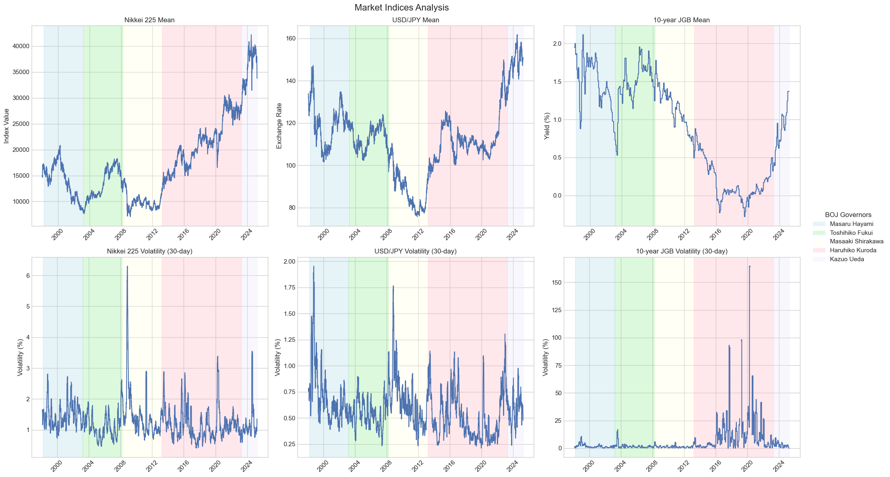

# BOJ Meeting Similarity and Market Impact Analysis





## Overview
This project analyzes how changes in Bank of Japan (BOJ) monetary policy meeting content correlate with financial market movements. It combines text similarity analysis of meeting minutes with market statistics to identify patterns between policy language changes and market outcomes.

## Keyword Categories and Analysis

The project analyzes BOJ meeting minutes by tracking mentions of keywords across various economic and policy categories:

### Inflation and Price Categories
1. **Inflation-related (インフレ関連)**
   - Keywords: インフレ, 上昇圧力, 上昇率, 期待, インフレーション, 物価上昇, インフレ期待, インフレ予想, インフレターゲティング, CPI, 消費者物価

2. **Deflation-related (デフレ関連)**
   - Keywords: デフレ, 下落圧力, 懸念, デフレーション, 物価下落, 物価下押し, デフレスパイラル

3. **Price-related (物価関連)**
   - Keywords: 物価, 消費者, 生産者, 卸売, 国内企業, 価格, 商品, 製品, 資産, 土地, 住宅, 輸出, 輸入

### Financial Markets and Policy
4. **Exchange Rate-related (為替関連)**
   - Keywords: 為替, 円相場, 円レート, ドル円, 円ドル, ユーロ円, 円安, 円高

5. **Interest Rate-related (金利関連)**
   - Keywords: 金利, 利率, 利回り, イールド, 貸出, 預金, 政策金利, 短期, 長期, コールレート, 国債

6. **Financial (金融)**
   - Keywords: 金融, 政策, 量的, 質的, マネー, 通貨, マネタリーベース, ベースマネー

7. **Monetary Easing (金融緩和関連)**
   - Keywords: 金融緩和, 量的緩和, 質的緩和, 緩和的, 緩和

8. **Monetary Tightening (金融引き締め)**
   - Keywords: 金融引き締め, 量的縮小, 量的引き締め, 引締, 資金吸収

### Economic Conditions
9. **Economic Conditions (景気関連)**
   - Keywords: 景気動向, 景況, 経済情勢, 経済状況, 景気, 経済活動, 需給ギャップ, GDP

10. **Consumption-related (消費関連)**
    - Keywords: 消費, 個人消費, 家計, 消費者, マインド, 賃金

### Institutional Categories
11. **Central Bank (中央銀行)**
    - Keywords: 中央銀行

12. **Government (政府)**
    - Keywords: 政府, 財政

13. **Financial Institutions (金融機関)**
    - Keywords: 金融機関

### Business and Production
14. **Investment-related (投資関連)**
    - Keywords: 投資, 設備投資, 資本投資, 企業, 民間, 公共投資

15. **SME-related (中小企業関連)**
    - Keywords: 中小企業, 人手, 資金繰り, 事業継承, 生産性向上, 中小事業者

16. **Production-related (生産関連)**
    - Keywords: 生産, 鉱工業, 工業, 製造, 設備, 収益, 輸出

### Labor Market
17. **Employment-related (雇用関連)**
    - Keywords: 雇用, 正規, 非正規, 求人, 人口, 賃金

18. **Unemployment-related (失業関連)**
    - Keywords: 失業, 構造的, 摩擦的, 求職

### Market and Other Categories
19. **Stock Market (株式)**
    - Keywords: 株式, 株, 証券会社

20. **Forecast-related (予想関連)**
    - Keywords: 予想, 見通し, 見込み, 想定, 期待, 見通し, 期待

21. **Others (その他)**
    - Keywords: アンカー, ノミナルアンカー

## Market Indices Analysis

The project tracks and analyzes three key market indices to understand the impact of BOJ policy discussions. For each index, we calculate several metrics using the following formulas:

### Common Calculations
- **Daily Returns**: For any market variable \(P_t\), the daily return \(r_t\) is calculated as:
  \[r_t = \frac{P_t - P_{t-1}}{P_{t-1}} \times 100\%\]

- **30-day Rolling Volatility**: The annualized standard deviation of daily returns over a 30-day window:
  \[\sigma_t = \sqrt{\frac{252}{30}\sum_{i=t-29}^t (r_i - \bar{r})^2}\]
  where \(\bar{r}\) is the mean return over the 30-day window and 252 is the number of trading days per year.

### 1. Nikkei 225 Index (日経平均株価)
- **Data Source**: Yahoo Finance (^N225)
- **Metrics Tracked**:
  - Daily closing prices \(P_t\)
  - Daily returns \(r_t\) as defined above
  - 30-day rolling volatility \(\sigma_t\) as defined above
  - Mean values between meetings: \(\bar{P} = \frac{1}{n}\sum_{t=1}^n P_t\)
  - Cumulative returns between meetings: \(R_c = \prod_{t=1}^n (1 + r_t) - 1\)

### 2. USD/JPY Exchange Rate (米ドル/円レート)
- **Data Source**: FRED (DEXJPUS)
- **Metrics Tracked**:
  - Daily exchange rates \(E_t\)
  - Daily returns \(r_t\) calculated using the same formula
  - 30-day rolling volatility \(\sigma_t\) as defined above
  - Mean values between meetings: \(\bar{E} = \frac{1}{n}\sum_{t=1}^n E_t\)
  - Cumulative returns between meetings: \(R_c = \prod_{t=1}^n (1 + r_t) - 1\)

### 3. 10-year Japanese Government Bond Yield (10年国債利回り)
- **Data Source**: FRED (IRLTLT01JPM156N)
- **Metrics Tracked**:
  - Daily yield values \(Y_t\)
  - Daily changes \(\Delta Y_t = Y_t - Y_{t-1}\)
  - 30-day rolling volatility of yield changes: \(\sigma_t = \sqrt{\frac{252}{30}\sum_{i=t-29}^t (\Delta Y_i - \overline{\Delta Y})^2}\)
  - Mean values between meetings: \(\bar{Y} = \frac{1}{n}\sum_{t=1}^n Y_t\)
  - Cumulative changes between meetings: \(\sum_{t=1}^n \Delta Y_t\)

### Analysis Periods
- Market data is analyzed across different BOJ governor terms:
  - Masaru Hayami (1998-2003)
  - Toshihiko Fukui (2003-2008)
  - Masaaki Shirakawa (2008-2013)
  - Haruhiko Kuroda (2013-2023)
  - Kazuo Ueda (2023-present)

### Market Statistics
For each period between BOJ meetings, the following statistics are calculated:
- Mean values and returns
- Volatility measures
- Cumulative returns
- Correlation with text similarity scores
- Impact analysis of significant policy language changes

## Features
- Scrape and download BOJ monetary policy meeting dates and minutes
- Extract and analyze text from BOJ meeting minutes (with Japanese language support)
- Calculate text similarity between consecutive meetings
- Fetch financial market data (Nikkei 225, USD/JPY, JGB)
- Calculate market statistics between policy meetings
- Analyze relationships between text similarity and market outcomes
- Generate visualizations of findings

## Analysis Steps

1. **Get BOJ meeting dates**: Retrieves historical BOJ monetary policy meeting dates
2. **Download BOJ documents**: Downloads meeting minutes and press conference PDFs
3. **Extract text**: Uses OCR to extract Japanese text from PDFs
4. **Analyze text content**: Processes and analyzes language patterns in meeting minutes
5. **Fetch market data**: Retrieves financial market performance data around meeting dates
6. **Calculate statistics**: Computes market performance metrics between meetings
7. **Combine analyses**: Integrates text analysis with market performance
8. **Analyze relationships**: Studies correlation between language patterns and market movements

## Data Sources

- BOJ meeting minutes and press conferences: Bank of Japan official website
- Financial market data: Yahoo Finance (via yfinance) and FRED

## Installation

### Prerequisites
- Python 3.7+
- pip (Python package installer)

### Setting up the environment

You have two options for setting up your Python environment for this project:

#### Option 1: Using a dedicated Conda environment (Recommended)

1. Create the project directory structure:

```bash
mkdir -p ~/BOJ_Analysis/pdfs ~/BOJ_Analysis/output
cd ~/BOJ_Analysis
# Place main.py in this directory
```

2. Create and activate a dedicated "textanalysis" Conda environment:

```bash
# Create the environment with Python 3.9
conda create -n textanalysis python=3.9
conda activate textanalysis
```

3. Install all required dependencies:

```bash
# Core scientific and data packages
conda install -c conda-forge numpy pandas matplotlib seaborn scikit-learn

# Web scraping and data fetching
conda install -c conda-forge requests beautifulsoup4 tqdm lxml
pip install yfinance pandas-datareader

# PDF processing
conda install -c conda-forge pypdf2 pdfminer.six
pip install pymupdf pikepdf pdf2image pytesseract

# Japanese text processing
pip install mecab-python3
```

4. Create an activation script for easier environment management:

```bash
# Save as ~/BOJ_Analysis/activate_textanalysis.sh
#!/bin/bash

# Activate the text analysis environment
conda activate textanalysis

# Print environment info
echo "Text Analysis environment activated"
echo "Python: $(python --version)"
echo "Working directory: $(pwd)"
```

Make it executable:
```bash
chmod +x ~/BOJ_Analysis/activate_textanalysis.sh
```

#### Option 2: Using a virtual environment

1. Create the project directory:

```bash
mkdir BOJ_Analysis
cd BOJ_Analysis
# Place main.py in this directory
```

2. Create and activate a virtual environment:

```bash
# For Windows
python -m venv venv
venv\Scripts\activate

# For macOS/Linux
python3 -m venv venv
source venv/bin/activate
```

3. Install the required packages:

```bash
pip install numpy pandas matplotlib seaborn scikit-learn tqdm requests beautifulsoup4 lxml yfinance pandas-datareader PyPDF2 pdfminer.six pymupdf pikepdf
```

4. For Japanese text processing (required for full functionality):

```bash
# For Ubuntu/Debian
sudo apt-get install mecab mecab-ipadic-utf8 libmecab-dev swig poppler-utils
pip install mecab-python3 pdf2image pytesseract

# For macOS (using Homebrew)
brew install mecab mecab-ipadic swig poppler
pip install mecab-python3 pdf2image pytesseract

# For Windows
# Install MeCab manually, then:
pip install mecab-python3 pdf2image pytesseract
```

5. Install Tesseract OCR for PDF processing:

```bash
# For Ubuntu/Debian
sudo apt-get install tesseract-ocr tesseract-ocr-jpn

# For macOS
brew install tesseract tesseract-lang

# For Windows
# Download and install from https://github.com/UB-Mannheim/tesseract/wiki
# Add Tesseract to PATH and download Japanese language data
```

## Usage

### Option 1: Using the dedicated textanalysis environment

1. Navigate to your project directory and activate the environment:

```bash
cd ~/BOJ_Analysis
source ./activate_textanalysis.sh
```

2. Run the main script:

```bash
python main.py
```

### Option 2: Using a virtual environment

1. Navigate to your project directory and activate the environment:

```bash
cd ~/BOJ_Analysis
# For Windows
venv\Scripts\activate
# For macOS/Linux
source venv/bin/activate
```

2. Run the main script:

```bash
python main.py
```

### Option 3: Using Google Colab with main.ipynb

1. Upload the main.ipynb notebook to Google Colab
2. Mount your Google Drive (required for saving outputs):
   ```python
   from google.colab import drive
   drive.mount('/content/drive')
   ```

3. Install the required dependencies:
   ```python
   !pip install numpy pandas matplotlib seaborn scikit-learn tqdm requests beautifulsoup4 lxml yfinance pandas-datareader PyPDF2 pdfminer.six pymupdf pikepdf pdf2image pytesseract mecab-python3
   ```

4. Install system dependencies:
   ```python
   !apt-get update
   !apt-get install -y tesseract-ocr tesseract-ocr-jpn poppler-utils mecab libmecab-dev mecab-ipadic-utf8
   ```

5. Run the analysis code cells in the notebook

The notebook provides the same functionality as the script but allows for interactive exploration of the data and visualizations.

### What the script does

The script will guide you through the following steps:
   - Download BOJ meeting dates
   - Optionally download BOJ meeting PDFs
   - Analyze meeting texts and calculate text similarity
   - Fetch market data
   - Calculate market statistics between meetings
   - Combine text and market analyses
   - Analyze relationships between meeting similarity and market outcomes

The results will be saved in the `BOJ_Analysis/output` directory:
   - CSV files with analyzed data
   - Visualizations of key findings

## Data Directory Structure

The script will create the following directory structure:

```
BOJ_Analysis/
│
├── pdfs/                  # Meeting minutes PDFs
│
└── output/                # Analysis results
    ├── boj_meeting_dates.csv
    ├── boj_text_analysis.csv
    ├── market_data.csv
    ├── boj_market_stats.csv
    ├── boj_combined_analysis.csv
    └── [visualization images]
```

## Configuration Options

You can modify the following variables at the top of `main.py` to customize your analysis:

- `BASE_DIR`: Base directory for the project
- `PDF_DIR`: Directory for storing PDFs
- `OUTPUT_DIR`: Directory for output files

## Troubleshooting

### Missing Japanese Text Processing

If you see the warning "Japanese text processing modules not available", the script will skip text analysis but still continue with other parts. To enable full functionality, install the Japanese text processing packages as described in the installation section.

### PDF Download Issues

If you encounter problems downloading PDFs, you can manually download them from the [BOJ website](https://www.boj.or.jp/en/mopo/mpmsche_minu/index.htm/) and place them in the `pdfs` directory.

### Market Data Access

The script uses Yahoo Finance and FRED for market data. If you encounter connection issues, try running the script again or check your internet connection.

## Notes for Advanced Users

- By default, the script processes only 5 pages of each PDF. You can adjust the `max_pages` parameter for more thorough analysis.
- The text analysis uses TF-IDF and cosine similarity. You can modify these algorithms in the code for different analysis approaches.
- Market data starts from 1998 by default but can be adjusted by modifying the `start_date` parameter in the `fetch_market_data` function.
- When running in Google Colab, the script automatically detects the environment and configures paths accordingly.

## Output

The analysis produces various outputs including:
- Text similarity analysis between consecutive BOJ meetings
- Keyword trend analysis (inflation, deflation, FX, etc.)
- Market performance metrics around meeting dates
- Correlation analysis between communication patterns and market movements
- Visualizations of key relationships and trends

## License

This project is available for personal and educational use.

---

# 日本語版 / Japanese Version

# 日本銀行金融政策決定会合の分析


## 概要
このプロジェクトは、日本銀行（日銀）の金融政策決定会合の議事録の内容を分析し、その内容と市場動向の関係を調査するものです。会合議事録のテキスト類似性分析と市場統計を組み合わせて、政策言語の変化と市場結果の間のパターンを特定します。

## キーワードカテゴリーと分析

本プロジェクトでは、以下の経済・政策カテゴリーにおけるキーワードの出現を追跡します：

### インフレと物価カテゴリー
1. **インフレ関連**
   - キーワード: インフレ, 上昇圧力, 上昇率, 期待, インフレーション, 物価上昇, インフレ期待, インフレ予想, インフレターゲティング, CPI, 消費者物価

2. **デフレ関連**
   - キーワード: デフレ, 下落圧力, 懸念, デフレーション, 物価下落, 物価下押し, デフレスパイラル

3. **物価関連**
   - キーワード: 物価, 消費者, 生産者, 卸売, 国内企業, 価格, 商品, 製品, 資産, 土地, 住宅, 輸出, 輸入

### 金融市場と政策
4. **為替関連**
   - キーワード: 為替, 円相場, 円レート, ドル円, 円ドル, ユーロ円, 円安, 円高

5. **金利関連**
   - キーワード: 金利, 利率, 利回り, イールド, 貸出, 預金, 政策金利, 短期, 長期, コールレート, 国債

6. **金融**
   - キーワード: 金融, 政策, 量的, 質的, マネー, 通貨, マネタリーベース, ベースマネー

7. **金融緩和関連**
   - キーワード: 金融緩和, 量的緩和, 質的緩和, 緩和的, 緩和

8. **金融引き締め**
   - キーワード: 金融引き締め, 量的縮小, 量的引き締め, 引締, 資金吸収

### 経済条件
9. **経済条件 (景気関連)**
   - キーワード: 景気動向, 景況, 経済情勢, 経済状況, 景気, 経済活動, 需給ギャップ, GDP

10. **消費関連**
    - キーワード: 消費, 個人消費, 家計, 消費者, マインド, 賃金

### 組織カテゴリー
11. **中央銀行**
    - キーワード: 中央銀行

12. **政府**
    - キーワード: 政府, 財政

13. **金融機関**
    - キーワード: 金融機関

### 事業と生産
14. **投資関連**
    - キーワード: 投資, 設備投資, 資本投資, 企業, 民間, 公共投資

15. **中小企業関連**
    - キーワード: 中小企業, 人手, 資金繰り, 事業継承, 生産性向上, 中小事業者

16. **生産関連**
    - キーワード: 生産, 鉱工業, 工業, 製造, 設備, 収益, 輸出

### 雇用関連
17. **雇用関連**
    - キーワード: 雇用, 正規, 非正規, 求人, 人口, 賃金

18. **失業関連**
    - キーワード: 失業, 構造的, 摩擦的, 求職

### 市場と他のカテゴリー
19. **株式**
    - キーワード: 株式, 株, 証券会社

20. **予想関連**
    - キーワード: 予想, 見通し, 見込み, 想定, 期待, 見通し, 期待

21. **Others (その他)**
    - キーワード: アンカー, ノミナルアンカー

## 市場指標分析

本プロジェクトでは、日銀の政策議論の影響を理解するために、以下の3つの主要な市場指標を追跡・分析します：

### 1. 日経平均株価
- **データソース**: Yahoo Finance (^N225)
- **追跡指標**:
  - 日次終値
  - 日次リターン
  - 30日間移動ボラティリティ
  - 会合間平均値
  - 会合間累積リターン

### 2. 米ドル/円レート
- **データソース**: FRED (DEXJPUS)
- **追跡指標**:
  - 日次為替レート
  - 日次リターン
  - 30日間移動ボラティリティ
  - 会合間平均値
  - 会合間累積リターン

### 3. 10年国債利回り
- **データソース**: FRED (IRLTLT01JPM156N)
- **追跡指標**:
  - 日次利回り
  - 日次変化
  - 30日間移動ボラティリティ
  - 会合間平均値
  - 会合間累積変化

### 分析期間
- 市場データは、異なる日銀総裁期間にわたって分析されます：
  - Masaru Hayami (1998-2003)
  - Toshihiko Fukui (2003-2008)
  - Masaaki Shirakawa (2008-2013)
  - Haruhiko Kuroda (2013-2023)
  - Kazuo Ueda (2023-present)

### 市場統計
各日銀会合間において、以下の統計情報が計算されます：
- 平均値とリターン
- ボラティリティ測定
- 累積リターン
- テキスト類似性スコアとの相関
- 重要な政策言語変化の影響分析

## 機能
- BOJ金融政策会合の日付と議事録のスクレイプとダウンロード
- BOJ会合議事録のテキスト（日本語言語サポート付き）の抽出と分析
- 連続する会合間のテキスト類似性の計算
- 金融市場データ（日経平均株価、米ドル/円レート、JGB）の取得
- 政策会合間の市場統計の計算
- テキスト類似性と市場結果の関係の分析
- 分析結果の可視化

## 分析手順

1. **BOJ会合日付の取得**: 過去の日銀金融政策会合日付の取得
2. **BOJドキュメントのダウンロード**: BOJ会合議事録とプレスカンファレンスPDFのダウンロード
3. **テキストの抽出**: OCRを使用してPDFから日本語テキストを抽出
4. **テキストコンテンツの分析**: BOJ会合議事録の言語パターンの処理と分析
5. **市場データの取得**: BOJ会合日付周辺の金融市場パフォーマンスデータの取得
6. **統計の計算**: BOJ会合間の市場パフォーマンスメトリクスの計算
7. **分析の組み合わせ**: テキスト分析と市場パフォーマンスの統合
8. **関係の分析**: 言語パターンと市場動向の間の相関分析

## データソース

- BOJ会合議事録とプレスカンファレンス: 日本銀行公式ウェブサイト
- 金融市場データ: Yahoo Finance (via yfinance)とFRED

## インストール

### 前提条件
- Python 3.7+
- pip (Pythonパッケージインストーラー)

### 環境設定

このプロジェクトのPython環境を設定するには、2つのオプションがあります：

#### オプション1: 専用Conda環境を使用（お勧め）

1. プロジェクトディレクトリ構造の作成：

```bash
mkdir -p ~/BOJ_Analysis/pdfs ~/BOJ_Analysis/output
cd ~/BOJ_Analysis
# main.pyをこのディレクトリに配置
```

2. 専用の"textanalysis" Conda環境の作成とアクティベーション：

```bash
# Python 3.9を使用して環境を作成
conda create -n textanalysis python=3.9
conda activate textanalysis
```

3. すべての必要な依存関係のインストール：

```bash
# Core scientific and data packages
conda install -c conda-forge numpy pandas matplotlib seaborn scikit-learn

# Web scraping and data fetching
conda install -c conda-forge requests beautifulsoup4 tqdm lxml
pip install yfinance pandas-datareader

# PDF processing
conda install -c conda-forge pypdf2 pdfminer.six
pip install pymupdf pikepdf pdf2image pytesseract

# Japanese text processing
pip install mecab-python3
```

4. 環境管理を容易にするためのアクティベーションスクリプトの作成：

```bash
# ~/BOJ_Analysis/activate_textanalysis.shとして保存
#!/bin/bash

# text analysis environmentをアクティベート
conda activate textanalysis

# 環境情報の印刷
echo "Text Analysis environment activated"
echo "Python: $(python --version)"
echo "Working directory: $(pwd)"
```

実行可能にする：
```bash
chmod +x ~/BOJ_Analysis/activate_textanalysis.sh
```

#### オプション2: 仮想環境を使用

1. プロジェクトディレクトリの作成：

```bash
mkdir BOJ_Analysis
cd BOJ_Analysis
# main.pyをこのディレクトリに配置
```

2. 仮想環境の作成とアクティベーション：

```bash
# Windowsの場合
python -m venv venv
venv\Scripts\activate

# macOS/Linuxの場合
python3 -m venv venv
source venv/bin/activate
```

3. 必要なパッケージのインストール：

```bash
pip install numpy pandas matplotlib seaborn scikit-learn tqdm requests beautifulsoup4 lxml yfinance pandas-datareader PyPDF2 pdfminer.six pymupdf pikepdf
```

4. 日本語テキスト処理（完全な機能を有効にするために必要）：

```bash
# Ubuntu/Debianの場合
sudo apt-get install mecab mecab-ipadic-utf8 libmecab-dev swig poppler-utils
pip install mecab-python3 pdf2image pytesseract

# macOS（Homebrewを使用）の場合
brew install mecab mecab-ipadic swig poppler
pip install mecab-python3 pdf2image pytesseract

# Windowsの場合
# MeCabを手動でインストールしてから：
pip install mecab-python3 pdf2image pytesseract
```

5. PDF処理用のTesseract OCRのインストール：

```bash
# Ubuntu/Debianの場合
sudo apt-get install tesseract-ocr tesseract-ocr-jpn

# macOSの場合
brew install tesseract tesseract-lang

# Windowsの場合
# https://github.com/UB-Mannheim/tesseract/wikiからダウンロードしてインストール
# TesseractをPATHに追加し、日本語言語データをダウンロード
```

## 使用法

### オプション1: 専用textanalysis環境を使用

1. プロジェクトディレクトリに移動し、環境をアクティベートします：

```bash
cd ~/BOJ_Analysis
source ./activate_textanalysis.sh
```

2. メインスクリプトを実行します：

```bash
python main.py
```

### オプション2: 仮想環境を使用

1. プロジェクトディレクトリに移動し、環境をアクティベートします：

```bash
cd ~/BOJ_Analysis
# Windowsの場合
venv\Scripts\activate
# macOS/Linuxの場合
source venv/bin/activate
```

2. メインスクリプトを実行します：

```bash
python main.py
```

### オプション3: Google Colabでmain.ipynbを使用

1. main.ipynbノートブックをGoogle Colabにアップロード
2. Google Driveをマウント（出力を保存するために必要）：
   ```python
   from google.colab import drive
   drive.mount('/content/drive')
   ```

3. 必要な依存関係をインストールします：
   ```python
   !pip install numpy pandas matplotlib seaborn scikit-learn tqdm requests beautifulsoup4 lxml yfinance pandas-datareader PyPDF2 pdfminer.six pymupdf pikepdf pdf2image pytesseract mecab-python3
   ```

4. システム依存関係をインストールします：
   ```python
   !apt-get update
   !apt-get install -y tesseract-ocr tesseract-ocr-jpn poppler-utils mecab libmecab-dev mecab-ipadic-utf8
   ```

5. ノートブックの分析コードセルを実行

ノートブックはスクリプトと同じ機能を提供しますが、データのインタラクティブな探索と可視化を可能にします。

### スクリプトが実行すること

スクリプトは以下の手順を通じて実行します：
   - BOJ会合日付のダウンロード
   - 必要に応じてBOJ会合PDFのダウンロード
   - 会合テキストの分析とテキスト類似性の計算
   - 市場データの取得
   - 会合間の市場統計の計算
   - テキストと市場分析の組み合わせ
   - 会合類似性と市場結果の間の関係の分析

結果は`BOJ_Analysis/output`ディレクトリに保存されます：
   - 分析されたデータのCSVファイル
   - 主要な分析結果の可視化

## データディレクトリ構造

スクリプトは以下のディレクトリ構造を作成します：

```
BOJ_Analysis/
│
├── pdfs/                  # Meeting minutes PDFs
│
└── output/                # Analysis results
    ├── boj_meeting_dates.csv
    ├── boj_text_analysis.csv
    ├── market_data.csv
    ├── boj_market_stats.csv
    ├── boj_combined_analysis.csv
    └── [visualization images]
```

## 設定オプション

main.pyのトップにある以下の変数を変更して、分析をカスタマイズできます：

- `BASE_DIR`: プロジェクトのベースディレクトリ
- `PDF_DIR`: PDFsを保存するディレクトリ
- `OUTPUT_DIR`: 出力ファイルのディレクトリ

## トラブルシューティング

### 日本語テキスト処理の欠落

日本語テキスト処理モジュールが利用できない場合に警告が表示される場合がありますが、スクリプトは他の部分を引き続き実行します。完全な機能を有効にするには、インストールセクションで説明されているように日本語テキスト処理パッケージをインストールしてください。

### PDFダウンロードの問題

PDFをダウンロードする際に問題が発生した場合は、[日本銀行ウェブサイト](https://www.boj.or.jp/en/mopo/mpmsche_minu/index.htm/)から手動でダウンロードし、`pdfs`ディレクトリに配置することもできます。

### 市場データアクセス

スクリプトはYahoo FinanceとFREDを使用して市場データを取得します。接続に問題が発生した場合は、スクリプトを再度実行するか、インターネット接続を確認してください。

## 高度なユーザー向けの注意点

- デフォルトでは、スクリプトは各PDFの5ページのみを処理します。分析をより徹底的にするために`max_pages`パラメータを調整できます。
- テキスト分析はTF-IDFとコサイン類似性を使用します。コード内のこれらのアルゴリズムを変更して、異なる分析アプローチにすることもできます。
- デフォルトでは市場データは1998年から開始されますが、`fetch_market_data`関数の`start_date`パラメータを変更することで調整できます。
- Google Colabで実行する場合、スクリプトは環境を自動検出し、パスを適切に設定します。

## 出力

分析はさまざまな出力を生成します。これには、以下が含まれます：
- 連続するBOJ会合間のテキスト類似性分析
- キーワードトレンド分析（インフレ、デフレ、FXなど）
- BOJ会合日付周辺の市場パフォーマンスメトリクス
- 政策言語パターンと市場動向の間の相関分析
- 主要な関係とトレンドの可視化

## ライセンス

このプロジェクトは個人的および教育目的での使用が可能です。
